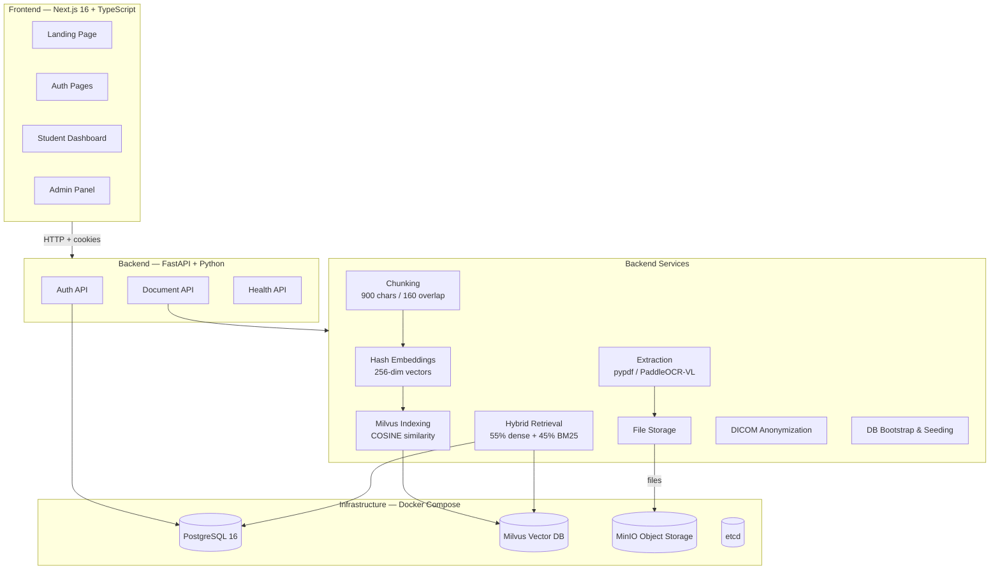
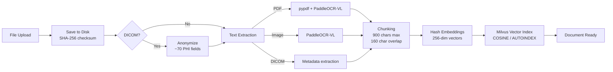

# MedVision AI — Complete Codebase Analysis

## What is MedVision AI?

**MedVision AI** is an AI-powered radiology education platform — a full-stack web application that lets radiology students upload their textbooks (PDFs, medical images, DICOMs), ask questions, and receive **grounded answers with citations**, **visual explainability (GradCAM)**, and **adaptive learning** (quizzes, flashcards, knowledge tracking).

> [!IMPORTANT]
> The project is a **Final Year Project (FYP) prototype**, currently in active development. Many dashboard features (quizzes, flashcards, achievements, AI assistant) are **UI-complete but driven by mock data** — the backend endpoints for these features have not yet been built.

---

## Architecture Overview



---

## Tech Stack

| Layer | Technology |
|-------|-----------|
| **Frontend** | Next.js 16, React 19, TypeScript, Tailwind CSS v4, Radix UI (shadcn), Recharts, Three.js (3D hero), Motion (Framer Motion), Zod validation |
| **Backend** | FastAPI, SQLAlchemy 2.0 (mapped columns), Pydantic v2 + pydantic-settings |
| **Database** | PostgreSQL 16 (Alpine) |
| **Vector DB** | Milvus 2.5.5 (backed by etcd + MinIO) |
| **OCR** | PaddleOCR-VL 1.5 (optional, GPU-accelerated) |
| **Auth** | JWT (access + refresh tokens), bcrypt password hashing, TOTP 2FA (admin), HttpOnly cookies |
| **Deployment** | Docker Compose (5 services), Vercel Analytics |

---

## Frontend Architecture

### Landing Page ([app/page.tsx](file:///c:/Users/emadh/OneDrive/Desktop/fyp_prototype/app/page.tsx))
Composed of 7 sections: `Navbar` → `HeroSection` (with Three.js 3D brain scene) → `AboutSection` → `FeaturesSection` → `MotivationSection` → `TeamSection` → `Footer`.

### Auth System ([app/(auth)/](file:///c:/Users/emadh/OneDrive/Desktop/fyp_prototype/app/(auth)))
- **Login** — email/password + optional TOTP for admin, lockout after 5 failed attempts
- **Register** — 3-step wizard (personal info → professional details → terms)
- **Forgot Password** — email-based reset request
- 11 reusable auth components: `AuthCard`, `AuthLeftPanel`, `FormInput`, `PasswordInput`, `PasswordStrengthMeter`, `OAuthButtons`, etc.

### Student Dashboard ([app/dashboard/](file:///c:/Users/emadh/OneDrive/Desktop/fyp_prototype/app/dashboard))
7 sub-features (all UI-complete with mock data):

| Feature | Route | Status |
|---------|-------|--------|
| Overview | `/dashboard` | Mock data — streak, XP, quiz scores, flashcard cards due, topic radar chart, streak calendar |
| Flashcards | `/dashboard/flashcards` | Mock — spaced-repetition deck UI |
| Quizzes | `/dashboard/quizzes` | Mock — MCQ quiz taking UI |
| AI Assistant | `/dashboard/assistant` | **Backend-connected** — sends queries to `/documents/search`, shows citations |
| GradCAM | `/dashboard/gradcam` | Mock — visual explainability overlay UI |
| Progress | `/dashboard/progress` | Mock — mastery tracking, BKT probability display |
| Achievements | `/dashboard/achievements` | Mock — badge & gamification UI |
| Settings | `/dashboard/settings` | Mock — profile/security/notifications settings |

### Admin Panel ([app/admin/](file:///c:/Users/emadh/OneDrive/Desktop/fyp_prototype/app/admin))
- Separate login with TOTP requirement
- Admin dashboard with mock data for: student management, quiz builder, content management, audit logs, system health monitoring, analytics

### Middleware ([middleware.ts](file:///c:/Users/emadh/OneDrive/Desktop/fyp_prototype/middleware.ts))
Cookie-based route protection:
- Students → `/dashboard` only
- Admins → `/admin/dashboard` only
- Logged-in users redirected away from auth pages

### State Management
- [AuthContext](file:///c:/Users/emadh/OneDrive/Desktop/fyp_prototype/context/AuthContext.tsx#22-51) — React context wrapping the entire app, handles login/register/logout/refresh/lockout state
- No global state library — each page manages its own state with `useState`/`useEffect`

---

## Backend Architecture

### Database Models ([models.py](file:///c:/Users/emadh/OneDrive/Desktop/fyp_prototype/backend/app/models.py)) — 14 tables

| Model | Purpose |
|-------|---------|
| [User](file:///c:/Users/emadh/OneDrive/Desktop/fyp_prototype/backend/app/models.py#65-92) | Students & admins, with TOTP secret, lockout tracking, radiology specialization fields |
| [Session](file:///c:/Users/emadh/OneDrive/Desktop/fyp_prototype/backend/app/models.py#94-109) | JWT refresh token sessions (token hash, IP, user agent, revocation tracking) |
| [AuditLog](file:///c:/Users/emadh/OneDrive/Desktop/fyp_prototype/backend/app/models.py#111-125) | Action-level audit logging (actor, action, target, metadata) |
| [Document](file:///c:/Users/emadh/OneDrive/Desktop/fyp_prototype/backend/app/models.py#127-160) | Uploaded files — PDF/image/DICOM with status pipeline (pending→processing→ready/failed) |
| [DocumentChunk](file:///c:/Users/emadh/OneDrive/Desktop/fyp_prototype/backend/app/models.py#162-185) | Chunked text from documents with lexical terms and embeddings |
| [IngestionJob](file:///c:/Users/emadh/OneDrive/Desktop/fyp_prototype/backend/app/models.py#187-208) | Tracks document processing stages (uploaded→extracting→chunking→indexing→completed) |
| [Quiz](file:///c:/Users/emadh/OneDrive/Desktop/fyp_prototype/types/dashboard.ts#48-60) / [QuizQuestion](file:///c:/Users/emadh/OneDrive/Desktop/fyp_prototype/backend/app/models.py#230-239) | Quiz content with IRT difficulty parameters |
| [FlashcardDeck](file:///c:/Users/emadh/OneDrive/Desktop/fyp_prototype/backend/app/models.py#241-256) / [Flashcard](file:///c:/Users/emadh/OneDrive/Desktop/fyp_prototype/types/dashboard.ts#36-47) | Flashcard content with tags |
| [UserProgress](file:///c:/Users/emadh/OneDrive/Desktop/fyp_prototype/backend/app/models.py#270-283) | Per-topic mastery scores with BKT probability |
| [Badge](file:///c:/Users/emadh/OneDrive/Desktop/fyp_prototype/types/dashboard.ts#88-99) / [UserBadge](file:///c:/Users/emadh/OneDrive/Desktop/fyp_prototype/backend/app/models.py#298-308) | Gamification badges with XP rewards |
| [LeaderboardEntry](file:///c:/Users/emadh/OneDrive/Desktop/fyp_prototype/backend/app/models.py#310-323) | Seasonal XP/streak/level leaderboard |

### API Routes

#### Auth Routes ([auth.py](file:///c:/Users/emadh/OneDrive/Desktop/fyp_prototype/backend/app/api/routes/auth.py))
| Endpoint | Method | Description |
|----------|--------|-------------|
| `/api/auth/register` | POST | Create student account |
| `/api/auth/login` | POST | JWT login with rate limiting (10/min), account lockout (5 fails → 15min), TOTP verification for admins |
| `/api/auth/me` | GET | Get current user from JWT |
| `/api/auth/refresh` | POST | Rotate refresh token, issue new access token |
| `/api/auth/logout` | POST | Revoke session, clear cookies |
| `/api/auth/forgot-password` | POST | Request password reset (audit-logged, no actual email sent yet) |

#### Document Routes ([documents.py](file:///c:/Users/emadh/OneDrive/Desktop/fyp_prototype/backend/app/api/routes/documents.py))
| Endpoint | Method | Description |
|----------|--------|-------------|
| `/api/documents/upload` | POST | Upload PDF/image/DICOM → triggers background ingestion |
| `/api/documents` | GET | List visible documents (owner's + shared for students, all for admins) |
| `/api/documents/{id}/chunks` | GET | Get document chunks |
| `/api/documents/search` | POST | Hybrid semantic search across visible documents |

### Document Ingestion Pipeline



Key details:
- **Extraction**: pypdf for native text, PaddleOCR-VL 1.5 for scanned/image-heavy pages, DICOM metadata parsing
- **Chunking**: 900-char max chunks with 160-char overlap, heading detection, paragraph-based splitting
- **Embeddings**: Deterministic hash-based embeddings (not neural) — lightweight placeholder for Phase 2
- **DICOM Anonymization**: Comprehensive PHI scrubbing (~70+ fields blanked/removed/re-UID'd)

### Hybrid Retrieval System ([retrieval.py](file:///c:/Users/emadh/OneDrive/Desktop/fyp_prototype/backend/app/services/retrieval.py))
Combines two scoring signals with **reciprocal rank fusion**:
- **Dense search (55% weight)**: Query embedding → Milvus cosine similarity
- **Lexical search (45% weight)**: BM25Okapi scoring over pre-tokenized terms
- Results include citations with document name, page range, section heading

### Security
- **JWT**: Short-lived access tokens (15 min) + long-lived refresh tokens (7 days), HttpOnly + SameSite=Lax cookies
- **Password**: bcrypt hashing
- **Admin 2FA**: TOTP (pyotp) with 1-window tolerance
- **Rate Limiting**: In-memory sliding window (10 attempts/60 seconds per email+IP)
- **Account Lockout**: 15-minute lockout after 5 failed attempts
- **Audit Logging**: All auth events logged to `audit_logs` table

---

## What's Working vs. Mock

| Feature | Status |
|---------|--------|
| Landing page | ✅ Fully functional |
| Auth (login/register/logout/refresh) | ✅ Fully functional against real backend |
| Document upload & ingestion pipeline | ✅ Fully functional |
| Hybrid document search | ✅ Fully functional |
| AI Assistant (using search) | ✅ Connected to backend search |
| Student dashboard overview | ⚠️ UI complete, **mock data** |
| Flashcards system | ⚠️ UI complete, **mock data** |
| Quizzes system | ⚠️ UI complete, **mock data** |
| GradCAM visualization | ⚠️ UI complete, **mock data** |
| Progress tracking | ⚠️ UI complete, **mock data** |
| Achievements/Badges | ⚠️ UI complete, **mock data** |
| Admin panel | ⚠️ UI complete, **mock data** |
| Password reset (actual email) | ❌ Audit-logged only, no email sending |
| Neural embeddings | ❌ Using hash-based placeholder |
| LLM-powered answer generation | ❌ Returns raw search snippets, no LLM synthesis |

---

## Project Structure Summary

```
fyp_prototype/
├── app/                          # Next.js pages
│   ├── (auth)/                   # Login, Register, Forgot Password
│   ├── admin/                    # Admin login + dashboard
│   ├── dashboard/                # Student dashboard (7 sub-routes)
│   ├── layout.tsx                # Root layout (AuthProvider, fonts, metadata)
│   └── page.tsx                  # Landing page
├── backend/                      # FastAPI backend
│   └── app/
│       ├── api/routes/           # auth, documents, health
│       ├── core/                 # config, database, security
│       ├── models.py             # 14 SQLAlchemy models
│       ├── schemas/              # Pydantic request/response schemas
│       └── services/             # 9 services (ingestion, retrieval, etc.)
├── components/                   # React components
│   ├── auth/                     # 11 auth components
│   ├── dashboard/                # Charts, GradCAM, shell, UI components
│   ├── landing/                  # 8 landing page sections
│   ├── admin/                    # Admin charts, shell, UI
│   └── ui/                       # 57 shadcn/Radix UI primitives
├── context/                      # AuthContext.tsx
├── hooks/                        # use-mobile, use-toast
├── lib/                          # API clients, mock data, validations, utils
├── types/                        # TypeScript type definitions
├── middleware.ts                  # Route protection middleware
├── docker-compose.yml            # PostgreSQL + Milvus + MinIO + etcd + backend
└── public/                       # Static assets, icons
```
